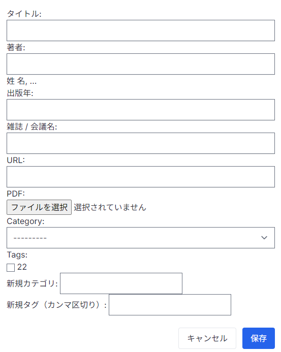
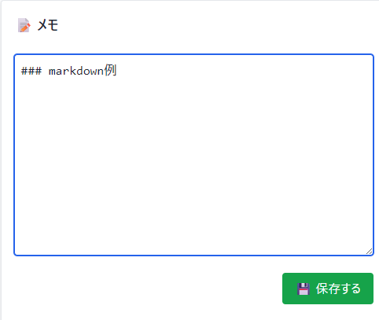
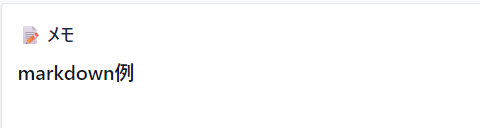
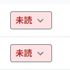

## 🛠️ 使い方

`http://127.0.0.1:9200/`に移動します。

### 1. 文献の一覧を表示する

* 初期画面では登録済みの文献一覧が表示されます。
* タイトル、著者、出版年、カテゴリ、タグなどが確認できます。

### 2. 新しい文献を登録する

* 「＋ 新規登録」ボタンをクリック
* タイトル・著者・年・PDFファイルを選択して保存
* タグやカテゴリが未登録の場合は入力欄に追加するだけで自動登録されます

### 3. 文献のPDFを表示して読む

* タイトルをクリックすると PDF表示ページへ移動します
* 画面左側に PDF が 表示され、ページ送りやスクロールで閲覧できます

### 4. メモをとる（Markdown対応）

* 画面右側には文献に関するメモ欄があります
* 「✏️ メモを編集」ボタンで書き込み可能
* 書式は **Markdown** で記述可能（箇条書き・リンク・数式対応）

メモを保存すると次のようにマークダウンに合った形で表示されます。

### 5. 読んだ進捗を管理する

* 一覧画面で「未読」「途中」「読了」などの進捗をドロップダウンで選択できます
* 変更は即保存され、背景色で進捗状況も可視化されます

### 6. 類似文献を AI で検索する

* PDF表示画面で「🔍 類似文献を探す」ボタンをクリック
* PDFの中身を AI が読み取り、ベクトル化し、類似文献を検索
* 類似文献はリストとしてその場で表示され、クリックでPDFへジャンプ

